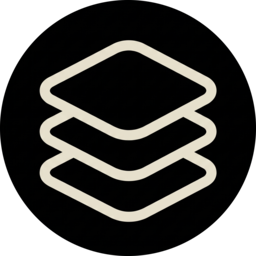

<p align="center">
  
</p>

<h1 align="center">MonolithCV</h1>

<p align="center">
  An offline desktop app that formats your CV to fit perfectly on a single A4 page.
</p>

---

MonolithCV is a offline desktop app built with Electron. I made it to help me build a professional CV that actually fits on a single A4 page without having to fight with margins and font sizes.

No sign-ups, no cloud syncing. It just runs on your machine and keeps all the data local.

## AI Assistance

Some parts of the code, such as drag-and-drop behavior, auto-fit logic, and local storage handling, were written or improved with the help of an AI assistant. The design decisions and core product direction were human-led.

## Features

- **Live A4 preview**: What you see on the screen is exactly what the printed PDF will look like.
- **Auto-fit**: The app automatically calculates font sizes, spacing, and margins to force your content to fit onto one page.
- **Drag & drop sections**: Reorder your CV sections directly from the preview pane.
- **6 Templates**: Choose between Minimalist, Compact, Modern, Classic, Tech, and Creative.
- **Profile photo editor**: Upload your picture, pan, zoom, and crop it (square, rounded, or circle).
- **Two-column layout**: Toggle the sidebar on or off depending on how much horizontal space you need.
- **Dark mode**: Supported out of the box.
- **Bilingual UI**: Available in English and Spanish.
- **Local & Private**: Everything is saved to your local storage. Export directly to PDF through the native print dialog.

## Current Limitations

The app is fully usable, but there are a few rough edges I'm still working on:

- The "Recent projects" panel on the main menu is visible but currently non-functional.
- Saving and loading projects is a bit manual at the moment:
  - **To save**: Open the *Data* tab inside the editor and click *Export Backup* to generate a `.json` file.
  - **To load**: Click *Import* in the main menu (or *Data → Import Backup* in the editor) and select your exported `.json` file.

I plan to streamline the save/load workflow in a future update.

## Usage

### Download

Head to the [Releases](../../releases) section and download the latest Windows build.

### Run from source

```bash
git clone https://github.com/KiddRwxSsj/MonolithCV.git
cd MonolithCV
npm install
npm start
```
